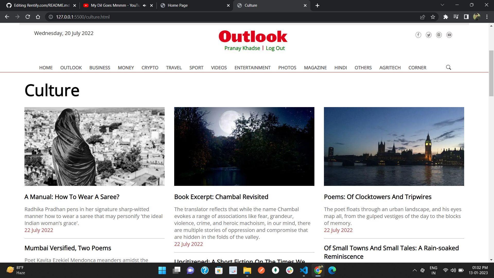

# Outlook India
Got an individual project to clone Outlook India website. I have completed this project within 4 days.
Outlook India is a daily news website, where you will find all kinds of national and international news.

In this project, I have made the foolowing things :
 - Signup Page
 - Log In Page
 - Home Page
 - Outlook Page and it's all 6 sub-categories pages.

---

### [click here to run live demo](https://snazzy-pasca-842614.netlify.app/index.html)

## Tech stacks used :
* **HTML**
* **CSS**
* **JavaScript**

***
## Log In Page :

## Sign Up Page :

## Home Page:

## Outlook Page : 

## Learnings :
- Implementation of HTML, CSS and JavaScript first time in a project.
- Time-management and Accountability.
- Learn to work in pressure.
- Learn to tackle problems and how to keep our-self motivated.
  

